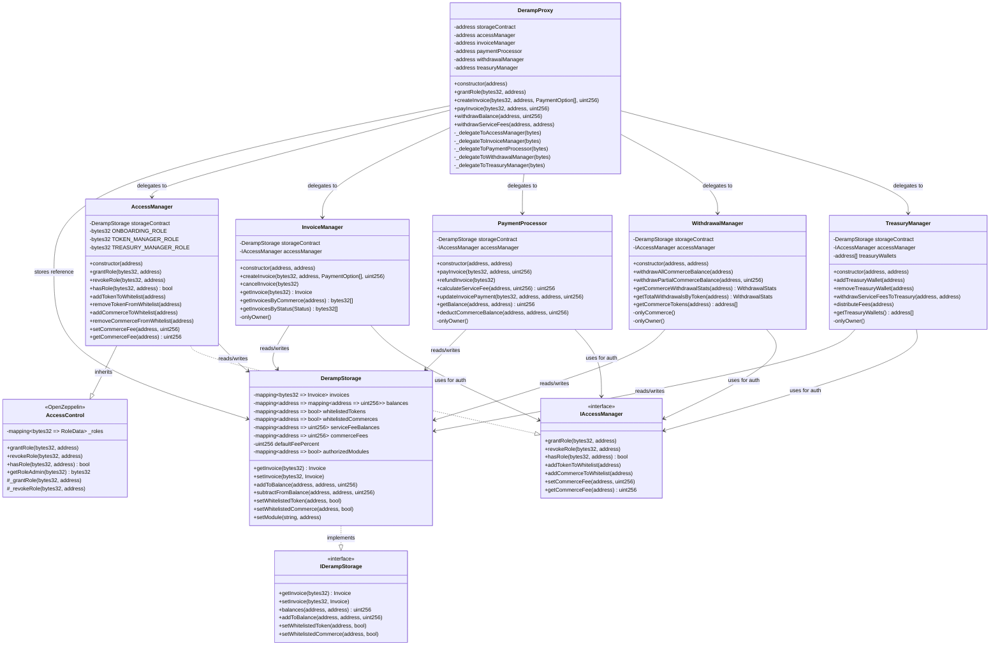
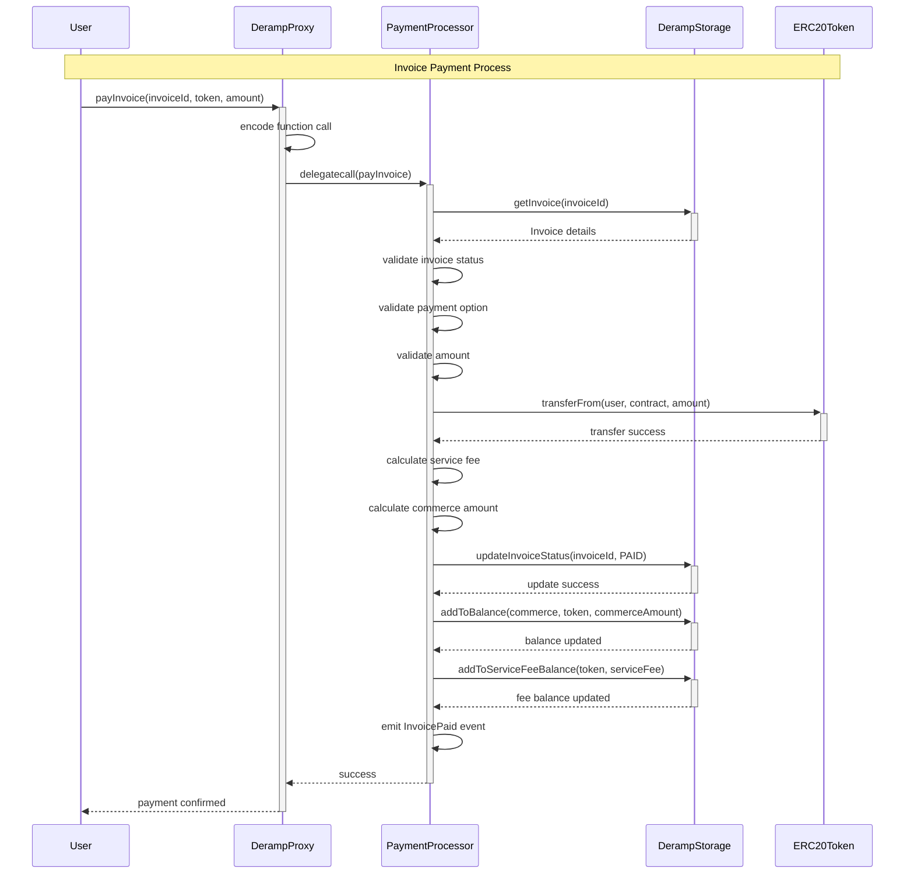
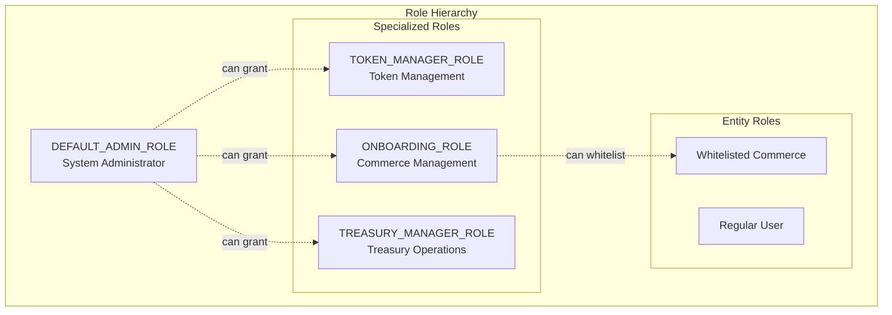
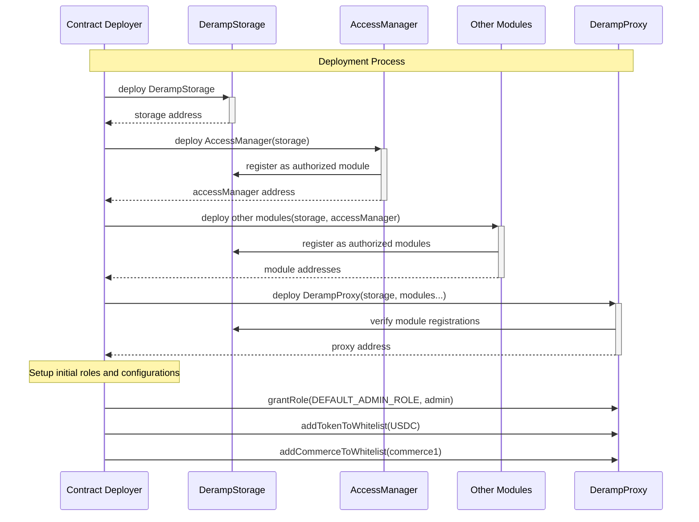

# Deramp Smart Contract System Architecture

## Table of Contents

1. [Overview](#overview)
2. [Architectural Principles](#architectural-principles)
3. [System Components](#system-components)
4. [UML Diagrams](#uml-diagrams)
5. [Data Flow](#data-flow)
6. [Security Model](#security-model)
7. [Deployment Architecture](#deployment-architecture)
8. [Integration Patterns](#integration-patterns)

## Overview

The Deramp Smart Contract System is a modular, proxy-based architecture designed for secure and efficient payment processing, invoice management, and treasury operations. The system follows a microservices-like approach where each module handles specific business logic while maintaining data consistency through a centralized storage layer.

### Key Features

- **Modular Design**: Specialized modules for different business functions
- **Proxy Pattern**: Single entry point with delegated execution
- **Role-Based Access Control**: Granular permissions system
- **Upgradeable Architecture**: Modules can be updated without data loss
- **Event-Driven**: Comprehensive logging and monitoring

## Architectural Principles

### 1. Separation of Concerns

Each module has a single, well-defined responsibility:

- **AccessManager**: Authentication and authorization
- **InvoiceManager**: Invoice lifecycle management
- **PaymentProcessor**: Payment processing and refunds
- **WithdrawalManager**: Balance withdrawals and analytics
- **TreasuryManager**: Treasury operations and fee distribution

### 2. Single Point of Entry

All external interactions go through the DerampProxy, which acts as a facade and request router.

### 3. Centralized Data Management

All persistent data is stored in DerampStorage, ensuring consistency and enabling atomic operations.

### 4. Interface Segregation

Each module implements specific interfaces, enabling loose coupling and testability.

### 5. Fail-Safe Defaults

The system defaults to restrictive permissions and requires explicit authorization for sensitive operations.

## System Components

### Core Components

#### DerampProxy

- **Purpose**: Main entry point and request router
- **Pattern**: Proxy/Facade pattern
- **Key Features**:
  - Delegates function calls to appropriate modules
  - Maintains module addresses
  - Provides unified interface for external interactions

#### DerampStorage

- **Purpose**: Centralized data repository
- **Pattern**: Repository pattern
- **Key Features**:
  - Stores all system data (invoices, balances, configurations)
  - Implements access control for data modifications
  - Provides atomic operations

### Business Logic Modules

#### AccessManager

- **Purpose**: Authentication and authorization
- **Pattern**: Strategy pattern
- **Key Features**:
  - Role-based access control (RBAC)
  - Token and commerce whitelisting
  - Fee configuration management

#### InvoiceManager

- **Purpose**: Invoice lifecycle management
- **Pattern**: State machine pattern
- **Key Features**:
  - Invoice creation and management
  - Payment option configuration
  - Invoice status tracking

#### PaymentProcessor

- **Purpose**: Payment processing
- **Pattern**: Command pattern
- **Key Features**:
  - Invoice payment processing
  - Fee calculation and distribution
  - Refund processing

#### WithdrawalManager

- **Purpose**: Balance management and withdrawals
- **Pattern**: Command pattern
- **Key Features**:
  - Commerce balance withdrawals
  - Withdrawal analytics and reporting
  - Balance verification

#### TreasuryManager

- **Purpose**: Treasury operations
- **Pattern**: Strategy pattern
- **Key Features**:
  - Service fee management
  - Treasury wallet management
  - Fee distribution to multiple wallets

## UML Diagrams

### System Architecture Diagram

```mermaid
graph TB
    %% External Actors
    subgraph "External Actors"
        User[User]
        Commerce[Commerce]
        Admin[System Admin]
    end

    %% Main System
    subgraph "Deramp System"
        Proxy[DerampProxy<br/>Entry Point]

        subgraph "Business Logic Layer"
            AccessMgr[AccessManager<br/>Auth & Permissions]
            InvoiceMgr[InvoiceManager<br/>Invoice Management]
            PaymentProc[PaymentProcessor<br/>Payment Processing]
            WithdrawalMgr[WithdrawalManager<br/>Withdrawal Management]
            TreasuryMgr[TreasuryManager<br/>Treasury Operations]
        end

        subgraph "Data Layer"
            Storage[DerampStorage<br/>Centralized Data]
        end

        subgraph "Interface Layer"
            IAccessMgr[IAccessManager]
            IInvoiceMgr[IInvoiceManager]
            IPaymentProc[IPaymentProcessor]
            IWithdrawalMgr[IWithdrawalManager]
            ITreasuryMgr[ITreasuryManager]
            IStorage[IDerampStorage]
        end
    end

    %% External Systems
    subgraph "External Systems"
        ERC20[ERC20 Tokens<br/>USDC, USDT, etc.]
        Wallets[External Wallets]
    end

    %% Connections
    User --> Proxy
    Commerce --> Proxy
    Admin --> Proxy

    Proxy -.->|delegatecall| AccessMgr
    Proxy -.->|delegatecall| InvoiceMgr
    Proxy -.->|delegatecall| PaymentProc
    Proxy -.->|delegatecall| WithdrawalMgr
    Proxy -.->|delegatecall| TreasuryMgr

    AccessMgr --> Storage
    InvoiceMgr --> Storage
    PaymentProc --> Storage
    WithdrawalMgr --> Storage
    TreasuryMgr --> Storage

    AccessMgr ..|> IAccessMgr
    InvoiceMgr ..|> IInvoiceMgr
    PaymentProc ..|> IPaymentProc
    WithdrawalMgr ..|> IWithdrawalMgr
    TreasuryMgr ..|> ITreasuryMgr
    Storage ..|> IStorage

    PaymentProc --> ERC20
    WithdrawalMgr --> ERC20
    TreasuryMgr --> ERC20
    WithdrawalMgr --> Wallets
    TreasuryMgr --> Wallets
```

### Class Diagram



### Sequence Diagram - Payment Flow



### Sequence Diagram - Role Management

```mermaid
sequenceDiagram
    participant Admin as System Admin
    participant Proxy as DerampProxy
    participant AccessMgr as AccessManager
    participant OZ as OpenZeppelin AccessControl

    Note over Admin,OZ: Role Granting Process

    Admin->>+Proxy: grantRole(TOKEN_MANAGER_ROLE, alice)
    Proxy->>Proxy: encode function call
    Proxy->>+AccessMgr: delegatecall(grantRole)

    Note over AccessMgr: Execution in Proxy context
    Note over AccessMgr: msg.sender = Admin

    AccessMgr->>AccessMgr: getRoleAdmin(TOKEN_MANAGER_ROLE)
    AccessMgr->>AccessMgr: check hasRole(DEFAULT_ADMIN_ROLE, Admin)

    alt Admin has required role
        AccessMgr->>+OZ: super.grantRole(role, alice)
        OZ->>OZ: update _roles mapping in Proxy
        OZ->>OZ: emit RoleGranted event
        OZ-->>-AccessMgr: role granted
        AccessMgr-->>-Proxy: success
        Proxy-->>-Admin: role granted successfully
    else Admin lacks required role
        AccessMgr-->>-Proxy: revert("AccessControlUnauthorizedAccount")
        Proxy-->>-Admin: error: unauthorized
    end
```

## Data Flow

### Payment Processing Flow

1. **User Initiates Payment**

   - User calls `payInvoice()` on DerampProxy
   - Proxy validates basic parameters

2. **Delegation to PaymentProcessor**

   - Proxy encodes function call using `abi.encodeWithSignature`
   - Proxy performs `delegatecall` to PaymentProcessor
   - PaymentProcessor executes in Proxy's context

3. **Invoice Validation**

   - PaymentProcessor retrieves invoice from DerampStorage
   - Validates invoice status (must be PENDING)
   - Validates payment option and amount

4. **Token Transfer**

   - PaymentProcessor calls ERC20 `transferFrom()`
   - Tokens transferred from user to contract

5. **Fee Calculation and Distribution**

   - Calculate service fee based on configured percentage
   - Calculate commerce amount (payment - service fee)

6. **State Updates**

   - Update invoice status to PAID
   - Add commerce amount to commerce balance
   - Add service fee to system fee balance

7. **Event Emission**
   - Emit `InvoicePaid` event for monitoring

### Withdrawal Flow

1. **Commerce Initiates Withdrawal**

   - Commerce calls withdrawal function on DerampProxy
   - Proxy delegates to WithdrawalManager

2. **Authorization Check**

   - WithdrawalManager verifies commerce is whitelisted
   - Checks commerce has sufficient balance

3. **Balance Updates**

   - Subtract withdrawn amount from commerce balance
   - Update withdrawal statistics

4. **Token Transfer**
   - Transfer tokens from contract to commerce wallet
   - Emit withdrawal event

## Security Model

### Role-Based Access Control (RBAC)

The system implements a hierarchical role-based access control system:

#### Role Hierarchy



#### Permission Matrix

| Role                  | Grant Roles | Manage Tokens | Manage Commerce | Create Invoices | Process Payments | Withdraw Funds | Manage Treasury |
| --------------------- | ----------- | ------------- | --------------- | --------------- | ---------------- | -------------- | --------------- |
| DEFAULT_ADMIN_ROLE    | ✅          | ✅            | ✅              | ✅              | ✅               | ✅             | ✅              |
| TOKEN_MANAGER_ROLE    | ❌          | ✅            | ❌              | ❌              | ❌               | ❌             | ❌              |
| ONBOARDING_ROLE       | ❌          | ❌            | ✅              | ❌              | ❌               | ❌             | ❌              |
| TREASURY_MANAGER_ROLE | ❌          | ❌            | ❌              | ❌              | ❌               | ❌             | ✅              |
| Whitelisted Commerce  | ❌          | ❌            | ❌              | ❌              | ❌               | ✅\*           | ❌              |
| Regular User          | ❌          | ❌            | ❌              | ❌              | ✅\*\*           | ❌             | ❌              |

\*Only their own balances  
\*\*Only paying existing invoices

### Security Features

#### 1. Delegatecall Security

- All module execution happens in Proxy context
- State modifications occur in Proxy storage
- Original caller context preserved for authorization

#### 2. Access Control

- Function-level access control using OpenZeppelin AccessControl
- Role-based permissions with granular control
- Fail-safe defaults (restrictive permissions)

#### 3. Input Validation

- Comprehensive parameter validation
- Address zero checks
- Amount and percentage limits
- Expiration time validation

#### 4. Reentrancy Protection

- OpenZeppelin ReentrancyGuard implementation
- Checks-Effects-Interactions pattern
- State updates before external calls

#### 5. Pausable Operations

- Emergency pause functionality
- Critical operations can be halted
- Admin-only pause/unpause controls

## Deployment Architecture

### Deployment Sequence



### Module Registration

Each module must be registered with DerampStorage to perform write operations:

```solidity
// During deployment
storage.setModule("AccessManager", accessManagerAddress);
storage.setModule("InvoiceManager", invoiceManagerAddress);
storage.setModule("PaymentProcessor", paymentProcessorAddress);
storage.setModule("WithdrawalManager", withdrawalManagerAddress);
storage.setModule("TreasuryManager", treasuryManagerAddress);
```

## Integration Patterns

### 1. Proxy Pattern Implementation

The system uses a transparent proxy pattern where:

- DerampProxy acts as the single entry point
- Business logic is delegated to specialized modules
- State is maintained in the proxy contract
- Modules can be upgraded without losing data

### 2. Interface Segregation

Each module implements specific interfaces:

- Enables loose coupling between components
- Facilitates testing and mocking
- Allows for module replacement
- Provides clear contracts for external integrations

### 3. Event-Driven Architecture

The system emits comprehensive events for:

- Invoice lifecycle changes
- Payment processing
- Balance modifications
- Role changes
- Administrative actions

### 4. Repository Pattern

DerampStorage acts as a repository:

- Centralizes all data access
- Provides consistent data access patterns
- Enables atomic operations
- Facilitates data migration and backup

## Best Practices and Recommendations

### 1. Deployment Best Practices

- Deploy modules in correct order (Storage → AccessManager → Other Modules → Proxy)
- Verify all module registrations before going live
- Set up proper role assignments during deployment
- Test all integrations in staging environment

### 2. Security Best Practices

- Use multi-signature wallets for admin roles
- Implement timelock for critical operations
- Regular security audits and penetration testing
- Monitor events for suspicious activities

### 3. Operational Best Practices

- Implement proper monitoring and alerting
- Maintain comprehensive documentation
- Regular backup of critical data
- Disaster recovery procedures

### 4. Development Best Practices

- Comprehensive unit and integration testing
- Code coverage above 90%
- Static analysis and linting
- Formal verification for critical functions

## Conclusion

The Deramp Smart Contract System represents a sophisticated, modular architecture that prioritizes security, maintainability, and scalability. The use of the proxy pattern with delegated execution, combined with role-based access control and comprehensive event logging, creates a robust foundation for payment processing and treasury management operations.

The system's modular design allows for easy upgrades and maintenance while preserving data integrity and user funds. The comprehensive security model, including multiple layers of access control and input validation, ensures that the system can operate safely in a production environment.

This architecture serves as a solid foundation for building complex DeFi applications while maintaining the flexibility to adapt to changing requirements and integrate with other blockchain systems.
